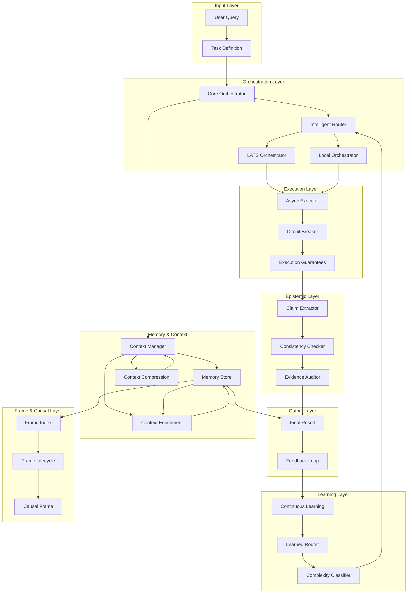
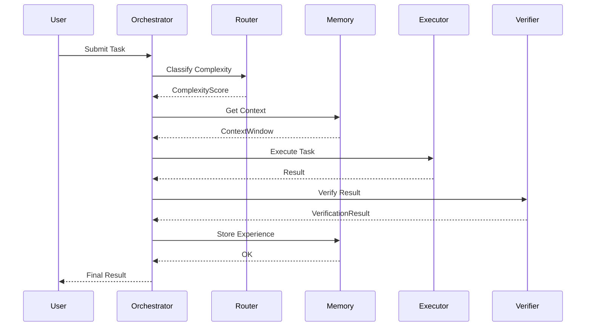

# RLM-Claude-Code System Architecture

> Comprehensive architecture document generated from code analysis.

## Overview

A sophisticated multi-agent orchestration system with intelligent routing, memory management, epistemic verification, and continuous learning capabilities. The system coordinates AI agents through various orchestration patterns (local, intelligent, LATS-based) with built-in reliability, caching, and optimization features.

---

## System Architecture Diagram



---

## Layer Details

### 1. Orchestration Layer

Core coordination and execution engine for AI agents.

| Module | Classes | Purpose |
|--------|---------|---------|
| `orchestrator/core.py` | `Orchestrator`, `ExecutionPlan`, `TaskContext` | Main orchestration loop |
| `orchestrator/intelligent.py` | `IntelligentOrchestrator`, `RoutingDecision` | Claude-powered routing decisions |
| `intelligent_orchestrator.py` | `IntelligentOrchestrator` | Multi-agent coordination |
| `local_orchestrator.py` | `LocalOrchestrator` | Local execution without remote calls |
| `lats_orchestration.py` | `LATSOrchestrator`, `LanguageModelTreeSearch` | Tree search orchestration |

**Key Methods:**

```python
# Core orchestration
Orchestrator.execute(task, context) -> Result
Orchestrator.plan_execution(task) -> ExecutionPlan
Orchestrator.route_to_agent(task) -> Agent
Orchestrator.aggregate_results(results) -> Result

# Intelligent routing
IntelligentOrchestrator.select_agent(task, capabilities) -> Agent
IntelligentOrchestrator.estimate_complexity(task) -> ComplexityScore
IntelligentOrchestrator.optimize_execution_plan(plan) -> ExecutionPlan

# LATS tree search
LATSOrchestrator.tree_search(task) -> Result
LATSOrchestrator.expand_node(node) -> List[Node]
LATSOrchestrator.select_best_path() -> Path
```

**Dependencies:** `context_manager`, `memory_store`, `config`, `learned_routing`, `complexity_classifier`, `cost_tracker`

---

### 2. Execution & Async Layer

Asynchronous execution and task management.

| Module | Classes | Purpose |
|--------|---------|---------|
| `async_executor.py` | `AsyncExecutor`, `TaskQueue`, `ExecutionResult` | Async task execution |
| `async_handler.py` | `AsyncHandler`, `CallbackRegistry` | Event handling |
| `orchestrator/async_executor.py` | `AsyncExecutor` | Coroutine execution |

**Key Methods:**

```python
AsyncExecutor.submit(task) -> TaskID
AsyncExecutor.await_result(task_id) -> Result
AsyncExecutor.cancel(task_id) -> bool

AsyncHandler.register_callback(event, callback)
AsyncHandler.emit(event, data)
```

**Dependencies:** `circuit_breaker`, `execution_guarantees`, `asyncio`

---

### 3. Memory & Context Layer

Memory storage, context management, and retrieval.

| Module | Classes | Purpose |
|--------|---------|---------|
| `memory_store.py` | `MemoryStore`, `MemoryEntry`, `RetrievalResult` | SQLite-based persistence |
| `memory_backend.py` | `MemoryBackend`, `VectorIndex`, `StorageBackend` | Abstract backend |
| `memory_evolution.py` | `MemoryEvolution`, `MemoryTransformer` | Tier management |
| `context_manager.py` | `ContextManager`, `ContextWindow`, `ContextSnapshot` | Context externalization |
| `context_index.py` | `ContextIndex`, `IndexedContext` | Context indexing |
| `context_enrichment.py` | `ContextEnricher` | Add relevant info |
| `context_compression.py` | `ContextCompressor` | Reduce context size |
| `context_slice.py` | `ContextSlice`, `SliceSelector` | Partition context |

**Key Methods:**

```python
# Memory operations
MemoryStore.store(key, value, metadata) -> str
MemoryStore.retrieve(query, k) -> List[MemoryEntry]
MemoryStore.evict(policy) -> int

# Memory evolution
MemoryEvolution.evolve_memory(memory) -> Memory
MemoryEvolution.compress_old_memories()
MemoryEvolution.promote_to_long_term(memory)

# Context management
ContextManager.add_context(item)
ContextManager.get_context_window() -> ContextWindow
ContextManager.compress_if_needed()

# Context slicing (SPEC-17)
ContextSlice.select_slice(full_context, criteria) -> Slice
ContextSlice.merge_slices(slices) -> Slice
```

**Dependencies:** `cache`, `embedding_retrieval`, `context_compression`

---

### 4. Epistemic & Verification Layer

Claim extraction, verification, and consistency checking.

| Module | Classes | Purpose |
|--------|---------|---------|
| `epistemic/claim_extractor.py` | `ClaimExtractor`, `Claim`, `Evidence` | Extract claims from text |
| `epistemic/consistency_checker.py` | `ConsistencyChecker`, `ConsistencyReport` | Detect contradictions |
| `epistemic/evidence_auditor.py` | `EvidenceAuditor`, `AuditResult` | Verify evidence sources |
| `epistemic/verification_cache.py` | `VerificationCache` | Cache verifications |
| `epistemic/verification_feedback.py` | `FeedbackCollector` | Collect feedback |
| `epistemic/types.py` | `Claim`, `Evidence`, `VerificationResult` | Type definitions |

**Key Methods:**

```python
ClaimExtractor.extract_claims(text) -> List[Claim]
ClaimExtractor.identify_entities(claim) -> List[Entity]
ClaimExtractor.extract_evidence(claim) -> Evidence

ConsistencyChecker.check_consistency(claims) -> ConsistencyReport
ConsistencyChecker.detect_contradictions(claims) -> List[Contradiction]

EvidenceAuditor.audit_evidence(claim) -> AuditResult
EvidenceAuditor.calculate_confidence(evidence) -> float
```

**Dependencies:** `gliner_extractor`, `epistemic/types`, `cache`

---

### 5. Learning & Optimization Layer

Continuous learning, routing optimization, and cost management.

| Module | Classes | Purpose |
|--------|---------|---------|
| `learned_routing.py` | `LearnedRouter`, `RoutingModel`, `RoutingFeatures` | ML-based routing |
| `continuous_learning.py` | `ContinuousLearner`, `LearningBuffer`, `ModelUpdater` | Online learning |
| `complexity_classifier.py` | `ComplexityClassifier`, `ComplexityScore` | Task complexity |
| `confidence_synthesis.py` | `ConfidenceSynthesizer` | Aggregate confidence |
| `cost_tracker.py` | `CostTracker`, `CostReport` | Token/cost tracking |
| `enhanced_budget.py` | `BudgetManager`, `BudgetAllocation` | Budget management |
| `compute_allocation.py` | `ComputeAllocator` | Resource allocation |

**Key Methods:**

```python
# Learned routing
LearnedRouter.predict_best_agent(task) -> Agent
LearnedRouter.train_routing_model(examples)
LearnedRouter.update_routing_stats(outcome)

# Continuous learning
ContinuousLearner.record_experience(experience)
ContinuousLearner.update_model()
ContinuousLearner.evaluate_performance() -> Metrics

# Complexity classification
ComplexityClassifier.classify_complexity(task) -> ComplexityScore
ComplexityClassifier.estimate_resources(task) -> ResourceEstimate

# Budget management
BudgetManager.allocate_budget(task) -> BudgetAllocation
BudgetManager.check_budget(operation) -> bool
CostTracker.track_cost(operation, cost)
CostTracker.get_total_cost() -> float
```

**Dependencies:** `complexity_classifier`, `continuous_learning`, `cost_tracker`

---

### 6. Reliability & Resilience Layer

Circuit breaking, guarantees, and fault tolerance.

| Module | Classes | Purpose |
|--------|---------|---------|
| `circuit_breaker.py` | `CircuitBreaker`, `CircuitState` | Fault tolerance |
| `execution_guarantees.py` | `ExecutionGuarantee`, `RetryPolicy`, `TimeoutPolicy` | Execution guarantees |
| `formal_verification.py` | `FormalVerifier`, `VerificationInvariant` | Formal checks |

**Key Methods:**

```python
CircuitBreaker.call(operation) -> Result
CircuitBreaker.reset()
CircuitBreaker.get_state() -> CircuitState

ExecutionGuarantee.ensure_execution(operation) -> Result
ExecutionGuarantee.apply_retry_policy(operation)
ExecutionGuarantee.enforce_timeout(operation)

FormalVerifier.verify_invariant(state) -> bool
FormalVerifier.check_preconditions(operation) -> bool
FormalVerifier.check_postconditions(result) -> bool
```

---

### 7. Frame & Causal Layer (SPEC-17)

Frame management, lifecycle, and causal reasoning.

| Module | Classes | Purpose |
|--------|---------|---------|
| `frame_index.py` | `FrameIndex`, `FrameReference` | Frame indexing |
| `frame_lifecycle.py` | `FrameLifecycle`, `FrameState` | State machine |
| `frame_invalidation.py` | `FrameInvalidator` | Cascade invalidation |
| `frame_serialization.py` | `FrameSerializer` | JSON serialization |
| `causal_frame.py` | `CausalFrame`, `CausalLink` | Tree-structured frames |

**Key Methods:**

```python
# Frame indexing
FrameIndex.index_frame(frame)
FrameIndex.lookup_frame(id) -> CausalFrame
FrameIndex.resolve_references(frame) -> List[Frame]

# Frame lifecycle
FrameLifecycle.create_frame(data) -> CausalFrame
FrameLifecycle.activate_frame(frame)
FrameLifecycle.deactivate_frame(frame)
FrameLifecycle.archive_frame(frame)

# Causal operations
CausalFrame.add_causal_link(cause, effect)
CausalFrame.trace_causality(effect) -> List[Cause]
CausalFrame.detect_cycles() -> List[Cycle]

# Serialization
FrameSerializer.serialize(frame) -> JSON
FrameSerializer.deserialize(data) -> CausalFrame
```

**Dependencies:** `memory_store`, `frame_lifecycle`

---

### 8. Plugin & Extension Layer

Extensibility through plugins and custom extractors.

| Module | Classes | Purpose |
|--------|---------|---------|
| `plugin_interface.py` | `Plugin`, `PluginHook`, `PluginContext` | Plugin contract |
| `plugin_registry.py` | `PluginRegistry` | Plugin management |
| `gliner_extractor.py` | `GLiNERExtractor` | Entity extraction |
| `embedding_retrieval.py` | `EmbeddingRetriever`, `EmbeddingModel` | Vector embeddings |
| `api_client.py` | `APIClient`, `APIResponse` | LLM API wrapper |

**Key Methods:**

```python
Plugin.register(plugin)
Plugin.execute_hook(hook_name, context)
Plugin.unregister(plugin)

PluginRegistry.register_plugin(plugin)
PluginRegistry.get_plugin(name) -> Plugin
PluginRegistry.list_plugins() -> List[Plugin]

GLiNERExtractor.extract_entities(text) -> List[Entity]
GLiNERExtractor.extract_relations(text) -> List[Relation]

EmbeddingRetriever.embed(text) -> Vector
EmbeddingRetriever.retrieve_similar(query, k) -> List[Result]

APIClient.request(endpoint, params) -> APIResponse
APIClient.stream_request(endpoint) -> AsyncIterator
```

---

### 9. Telemetry & Monitoring Layer

Logging, telemetry, and observability.

| Module | Classes | Purpose |
|--------|---------|---------|
| `orchestration_telemetry.py` | `TelemetryCollector`, `Metric`, `Span` | Metrics collection |
| `orchestration_logger.py` | `OrchestrationLogger` | Structured logging |

**Key Methods:**

```python
TelemetryCollector.record_metric(name, value)
TelemetryCollector.start_span(operation) -> Span
TelemetryCollector.end_span(span)
TelemetryCollector.export_metrics() -> Dict

OrchestrationLogger.log_event(event, context)
OrchestrationLogger.log_error(error)
OrchestrationLogger.log_metrics(metrics)
```

---

### 10. Configuration & Schema Layer

Configuration management and type schemas.

| Module | Classes | Purpose |
|--------|---------|---------|
| `config.py` | `Config`, `AgentConfig`, `SystemConfig` | Configuration |
| `orchestration_schema.py` | `Task`, `Result`, `AgentResponse`, `OrchestrationPlan` | Schemas |

**Key Methods:**

```python
Config.load_config(path) -> Config
Config.get_agent_config(name) -> AgentConfig
Config.validate_config() -> bool
```

---

### 11. Advanced Features Layer

Advanced capabilities like auto-activation and cross-session promotion.

| Module | Classes | Purpose |
|--------|---------|---------|
| `auto_activation.py` | `AutoActivator` | Complexity-based activation |
| `cross_session_promotion.py` | `SessionPromoter` | Session memory promotion |
| `cache.py` | `Cache`, `CacheEntry` | Caching layer |
| `cell_manager.py` | `CellManager` | Cell-based routing |
| `orchestrator/checkpointing.py` | `CheckpointManager` | State checkpointing |
| `orchestrator/steering.py` | `OrchestrationSteering` | Execution steering |
| `learning.py` | `LearningEngine`, `ExperienceBuffer` | Learning engine |

**Key Methods:**

```python
AutoActivator.should_activate(task) -> bool
AutoActivator.auto_configure_agent(task) -> AgentConfig

SessionPromoter.promote_to_session(memory)
SessionPromoter.merge_sessions(sessions) -> Session

Cache.get(key) -> Value
Cache.set(key, value, ttl)
Cache.invalidate(pattern)

CheckpointManager.create_checkpoint(state) -> CheckpointID
CheckpointManager.restore_checkpoint(checkpoint_id) -> State
```

---

## Key Types

| Type | Description |
|------|-------------|
| `Task` | Unit of work to be executed |
| `Result` | Output from agent execution |
| `AgentResponse` | Structured response from an agent |
| `OrchestrationPlan` | Execution plan for task routing |
| `Claim` | Extracted factual claim from text |
| `Evidence` | Supporting evidence for claims |
| `VerificationResult` | Result of epistemic verification |
| `ConfidenceScore` | Confidence level for predictions |
| `MemoryEntry` | Stored memory with metadata |
| `ContextWindow` | Managed context for LLM calls |
| `CausalFrame` | Tree-structured knowledge frame (SPEC-17) |
| `ContextSlice` | Partitioned context per frame |
| `CausalLink` | Causal relationship between frames |
| `RoutingDecision` | Agent routing decision |
| `ComplexityScore` | Task complexity assessment |
| `CostReport` | Cost tracking report |
| `BudgetAllocation` | Budget allocation for tasks |
| `Plugin` | Extensible plugin interface |
| `Metric` | Telemetry metric |
| `Span` | Distributed tracing span |
| `Config` | System configuration |
| `Checkpoint` | Execution state checkpoint |

---

## Extension Points

| Extension Point | How to Extend |
|-----------------|---------------|
| **Plugin Interface** | Register custom plugins via `Plugin` base class |
| **Custom Extractors** | Implement entity extractors like `GLiNERExtractor` |
| **Routing Strategies** | Extend `LearnedRouter` for custom routing logic |
| **Memory Backends** | Implement custom `MemoryBackend` for different storage |
| **Verification Modules** | Add custom verification in epistemic layer |
| **Orchestration Patterns** | Create new orchestrators extending base classes |
| **Telemetry Exporters** | Add custom metric exporters |
| **Context Enrichers** | Implement custom context enrichment strategies |
| **Cache Implementations** | Swap cache backend via `Cache` interface |
| **Agent Capabilities** | Register new agent types in orchestrator |

---

## Data Flow



---

## File Structure

```
src/
├── orchestrator/
│   ├── core.py              # Core orchestration
│   ├── intelligent.py       # Intelligent routing
│   ├── async_executor.py    # Async execution
│   ├── checkpointing.py     # State checkpoints
│   └── steering.py          # Execution steering
├── epistemic/
│   ├── types.py             # Claim/Evidence types
│   ├── claim_extractor.py   # Extract claims
│   ├── consistency_checker.py
│   ├── evidence_auditor.py
│   ├── verification_cache.py
│   └── verification_feedback.py
├── orchestrator.py          # Main RLM loop
├── intelligent_orchestrator.py
├── local_orchestrator.py
├── lats_orchestration.py
├── rlaph_loop.py            # RLAPH execution loop
├── repl_environment.py      # Sandboxed Python REPL
├── recursive_handler.py     # Sub-query management
├── memory_store.py          # SQLite memory (SPEC-02)
├── memory_backend.py        # Abstract backend
├── memory_evolution.py      # Memory tiers (SPEC-03)
├── context_manager.py       # Context externalization
├── context_index.py         # Context indexing
├── context_enrichment.py    # Add relevant info
├── context_compression.py   # Reduce context
├── context_slice.py         # Partition context (SPEC-17)
├── causal_frame.py          # CausalFrame (SPEC-17)
├── frame_index.py           # Frame indexing
├── frame_lifecycle.py       # State machine
├── frame_invalidation.py    # Cascade invalidation
├── frame_serialization.py   # JSON serialization
├── session_manager.py       # Session management
├── session_schema.py        # Session types
├── reasoning_traces.py      # Decision trees (SPEC-04)
├── enhanced_budget.py       # Cost tracking (SPEC-05)
├── cost_tracker.py          # Token accounting
├── trajectory.py            # Event logging
├── trajectory_analysis.py   # Strategy extraction
├── strategy_cache.py        # Learn from success
├── learned_routing.py       # ML-based routing
├── continuous_learning.py   # Online learning
├── complexity_classifier.py # Task complexity
├── auto_activation.py       # Auto-activate RLM
├── plugin_interface.py      # Plugin contract
├── plugin_registry.py       # Plugin management
├── config.py                # Configuration
├── types.py                 # Core types
└── api_client.py            # LLM API wrapper
```

---

## Related Documentation

- [SPEC Overview](./spec/00-overview.md) - Capability specifications
- [Causal Frames SPEC-17](./spec/17-causal-frames.md) - Frame system details
- [Memory Store Review](./process/memory-store-review.md) - Memory architecture
- [Architecture ADRs](./process/architecture.md) - Design decisions

---

*Generated: 2026-02-19*
