# RLM Data Flow Diagrams

Visual diagrams for the RLM (Recursive Language Model) and CausalFrame system.

## Overview Diagram

## Phase 1-8: Complete Data Flow

## Frame Persistence Process

## CausalFrame Structure

## Loading Old Frames

## Loading Mechanisms Comparison

## Invalidation Chain Cascade

## Invalidation Rules

```mermaid
flowchart TB
    subgraph Rules["Invalidation Rules"]
        R1[Rule 1: Direct File Reference]
        R2[Rule 2: Dependency Chain]
        R3[Rule 3: Context Slice Mismatch]
    end

    subgraph Conditions["Conditions"]
        C1[frame.source_files<br/>contains changed_file]
        C2[frame.dependencies<br/>contains invalid_frame_id]
        C3[ContextSlice.content<br/>≠ current file content]
    end

    subgraph Actions["Actions"]
        A[Mark Frame INVALID]
    end

    R1 --> C1 --> A
    R2 --> C2 --> A
    R3 --> C3 --> A

    style A fill:#ffcdd2
```

## Dependency Graph Example

## Session Artifacts Structure

## Revalidation Process

