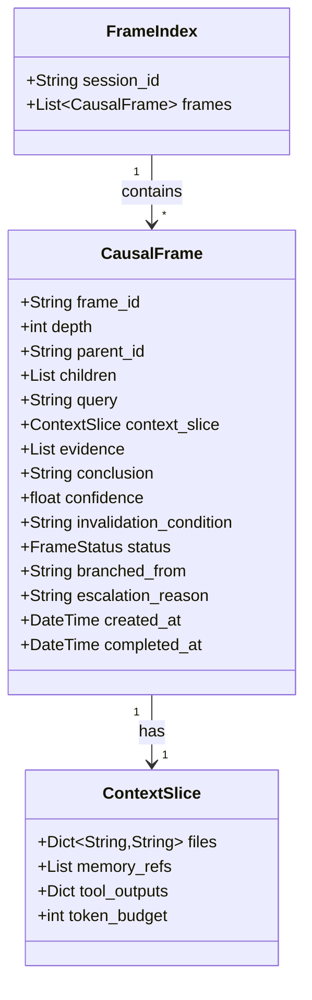
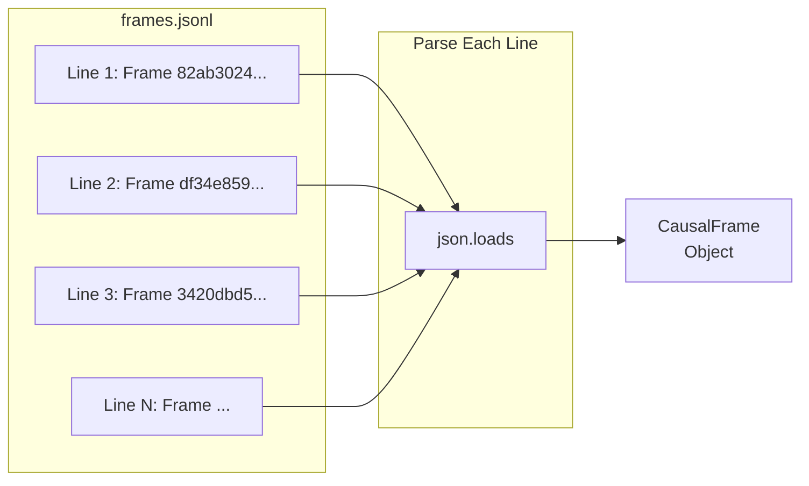
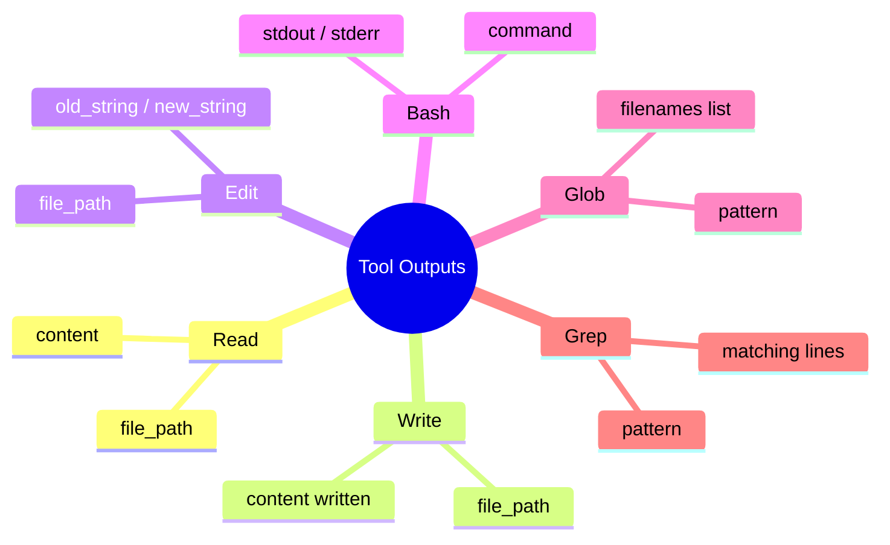
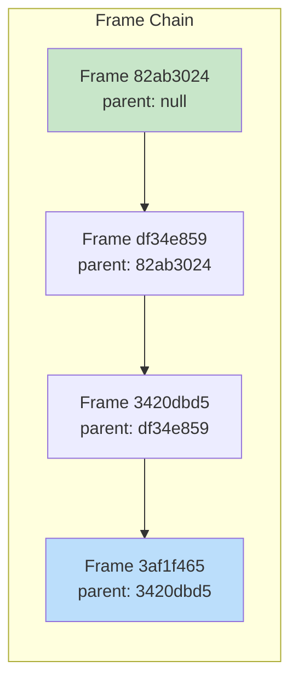
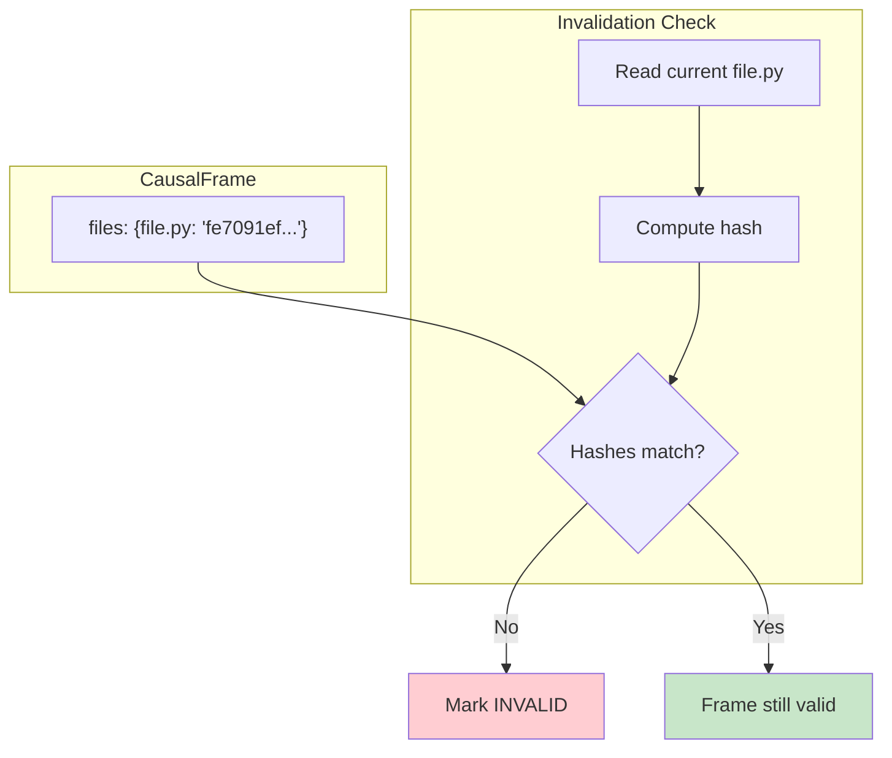
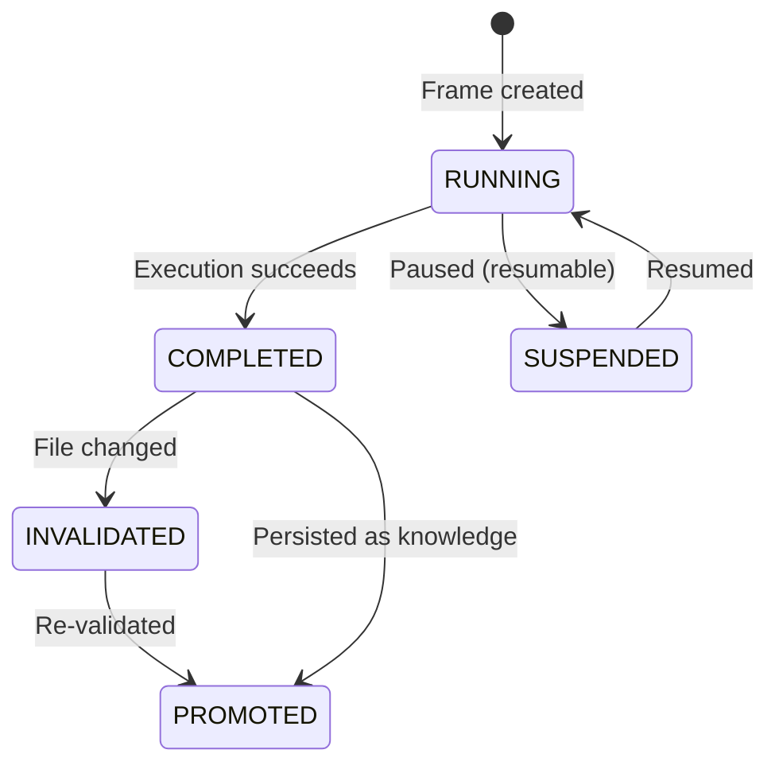
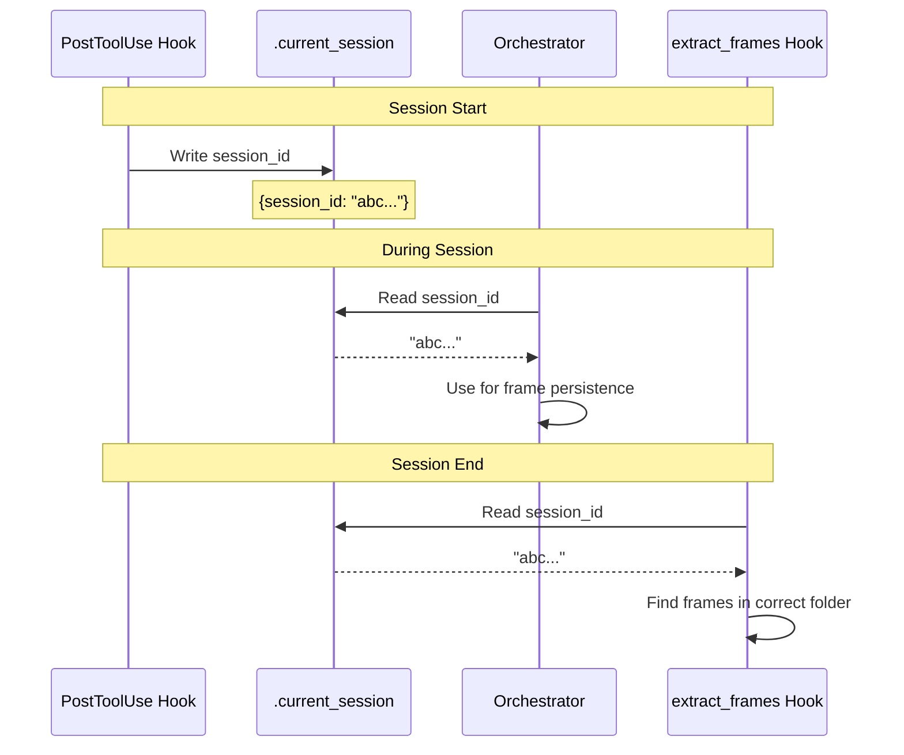

# Understanding Session Data

This document explains how to read and understand the data stored in a Claude Code session folder.

## Session Folder Location

```
~/.claude/rlm-frames/{session_id}/
```

Example: `~/.claude/rlm-frames/039f5c9f-e804-44d9-9946-1098a64c8c1b/`

## Folder Structure

```mermaid
flowchart TB
    subgraph SessionFolder["Session Folder<br/>~/.claude/rlm-frames/{session_id}/"]
        direction TB
        Index[index.json<br/>FrameIndex with all frames]
        Frames[frames.jsonl<br/>CausalFrames (JSONL)]
        Tools[tools.jsonl<br/>Tool outputs from hooks]
    end

    subgraph Coordination["Coordination"]
        Current[.current_session<br/>Current session ID]
    end

    Current -->|"links to"| SessionFolder

    style Index fill:#e3f2fd
    style Frames fill:#fff3e0
    style Tools fill:#e8f5e9
```

## File Overview

| File | Purpose | Format | Updated By |
|------|---------|--------|------------|
| `index.json` | FrameIndex with all frames | JSON | RLAPHLoop (on exit) |
| `frames.jsonl` | Individual CausalFrames | JSONL (1 JSON per line) | extract_frames hook |
| `tools.jsonl` | Tool outputs from Claude | JSONL (1 JSON per line) | PostToolUse hook |

---

## 1. index.json - FrameIndex

The master index of all CausalFrames in the session.

### Structure

```json
{
  "session_id": "039f5c9f-e804-44d9-9946-1098a64c8c1b",
  "frames": [
    {
      "frame_id": "82ab3024044daeb5",
      "depth": 0,
      "parent_id": null,
      "children": [],
      "query": "read_file(\"/path/to/file.py\")",
      "context_slice": {...},
      "evidence": [],
      "conclusion": "...",
      "confidence": 0.8,
      "invalidation_condition": "",
      "status": "completed",
      "branched_from": null,
      "escalation_reason": null,
      "created_at": "2026-02-20T13:51:05.504746",
      "completed_at": "2026-02-20T13:51:05.504755"
    },
    ...
  ]
}
```

### Field Reference



### Key Fields Explained

| Field | Description | Example |
|-------|-------------|---------|
| `frame_id` | Unique 16-char hex ID | `82ab3024044daeb5` |
| `depth` | Recursion depth (0 = root) | `0`, `1`, `2` |
| `parent_id` | Previous frame in chain | `null` or frame_id |
| `query` | The REPL command executed | `read_file("/path/to/file.py")` |
| `context_slice.files` | File → hash mapping | `{"file.py": "fe7091ef..."}` |
| `conclusion` | Result/output of the query | First ~200 chars of file content |
| `confidence` | Confidence score (0-1) | `0.8` |
| `status` | Frame lifecycle state | `completed`, `running`, `invalidated` |

---

## 2. frames.jsonl - CausalFrames

Individual CausalFrame objects, one per line (JSONL format).

### Structure (same as index.json frames)



### Reading frames.jsonl

```python
import json
from pathlib import Path

session_id = "039f5c9f-e804-44d9-9946-1098a64c8c1b"
frames_path = Path.home() / ".claude" / "rlm-frames" / session_id / "frames.jsonl"

with open(frames_path) as f:
    for line in f:
        frame = json.loads(line)
        print(f"Frame {frame['frame_id']}: {frame['query'][:50]}...")
```

---

## 3. tools.jsonl - Tool Outputs

Captures every tool call made by Claude Code during the session.

### Structure

```json
{
  "type": "tool_output",
  "session_id": "039f5c9f-e804-44d9-9946-1098a64c8c1b",
  "tool_name": "Read",
  "tool_input": {"file_path": "/path/to/file.py"},
  "tool_output": "...",
  "tool_use_id": "call_abc123..."
}
```

### Tool Types



### Reading tools.jsonl

```python
import json
from pathlib import Path

session_id = "039f5c9f-e804-44d9-9946-1098a64c8c1b"
tools_path = Path.home() / ".claude" / "rlm-frames" / session_id / "tools.jsonl"

with open(tools_path) as f:
    for line in f:
        record = json.loads(line)
        if record.get("type") == "tool_output":
            print(f"{record['tool_name']}: {record.get('tool_input', {})}")
```

---

## Frame Chain Navigation

Frames are linked via `parent_id`, forming a chain:



### Navigation Code

```python
def get_frame_chain(index: dict) -> list:
    """Get frames in order from root to latest."""
    frames_by_id = {f["frame_id"]: f for f in index["frames"]}

    # Find root frame (no parent)
    root = next(f for f in index["frames"] if f["parent_id"] is None)

    # Walk the chain
    chain = [root]
    current = root
    while True:
        # Find child of current
        child = next(
            (f for f in index["frames"] if f["parent_id"] == current["frame_id"]),
            None
        )
        if child is None:
            break
        chain.append(child)
        current = child

    return chain
```

---

## Context Slice - File Hashes

The `context_slice.files` field maps file paths to content hashes:

```json
"context_slice": {
  "files": {
    "/path/to/rlaph_loop.py": "fe7091ef08723e3f"
  }
}
```

### Purpose

1. **Invalidation Detection**: Compare hash with current file to detect changes
2. **Evidence Tracking**: Know which version of a file was used
3. **Reproducibility**: Can verify the exact content used



---

## Understanding Frame Status



| Status | Meaning |
|--------|---------|
| `running` | Currently executing |
| `completed` | Successfully finished |
| `suspended` | Paused, can be resumed |
| `invalidated` | No longer valid (file changed) |
| `promoted` | Persisted as long-term knowledge |

---

## Practical Analysis Examples

### 1. Count frames by type

```python
def count_by_query_type(index: dict) -> dict:
    """Count frames by the type of query."""
    counts = {}
    for frame in index["frames"]:
        query = frame.get("query", "")
        if "read_file" in query:
            qtype = "file_read"
        elif "glob_files" in query:
            qtype = "glob"
        elif "search" in query:
            qtype = "search"
        else:
            qtype = "other"
        counts[qtype] = counts.get(qtype, 0) + 1
    return counts
```

### 2. Get all files accessed

```python
def get_all_files(index: dict) -> set:
    """Get all files referenced in frames."""
    files = set()
    for frame in index["frames"]:
        files.update(frame["context_slice"]["files"].keys())
    return files
```

### 3. Find frames for a specific file

```python
def find_frames_for_file(index: dict, file_path: str) -> list:
    """Find all frames that reference a specific file."""
    return [
        f for f in index["frames"]
        if file_path in f["context_slice"]["files"]
    ]
```

---

## Coordination File

The `.current_session` file coordinates session ID across components:

```json
{
  "session_id": "039f5c9f-e804-44d9-9946-1098a64c8c1b",
  "pid": 12345,
  "updated_at": "2026-02-20T13:51:05.504746"
}
```

### Purpose



---

## Quick Reference Card

```
┌─────────────────────────────────────────────────────────────┐
│                    SESSION DATA QUICK REF                    │
├─────────────────────────────────────────────────────────────┤
│  index.json      →  FrameIndex (all frames in one JSON)     │
│  frames.jsonl    →  CausalFrames (one JSON per line)        │
│  tools.jsonl     →  Tool outputs (one JSON per line)        │
├─────────────────────────────────────────────────────────────┤
│  frame_id        →  16-char hex unique ID                   │
│  parent_id       →  Links to previous frame in chain        │
│  context_slice   →  Files accessed with content hashes      │
│  conclusion      →  Output/result of the REPL query         │
│  status          →  running|completed|invalidated|promoted  │
├─────────────────────────────────────────────────────────────┤
│  Reading JSONL:                                              │
│    with open(path) as f:                                     │
│        for line in f:                                        │
│            record = json.loads(line)                         │
└─────────────────────────────────────────────────────────────┘
```
